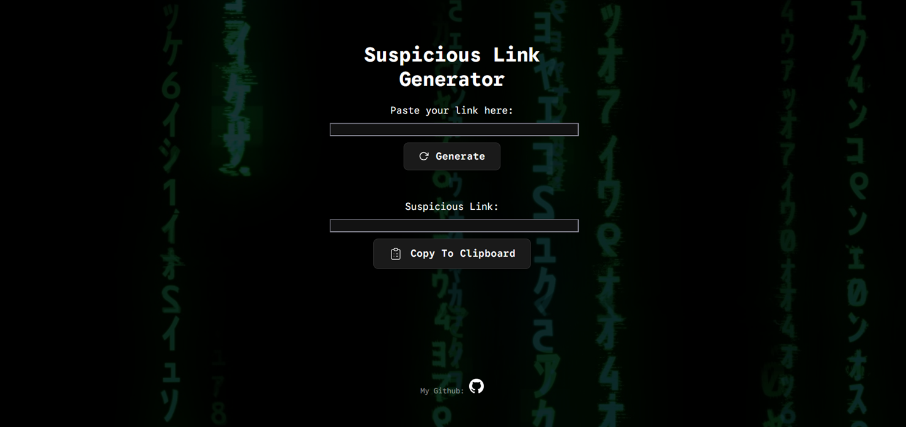

# Suspicious Link Generator

Hey all, I recently learned Vue.js and I decided to make a small yet harmless prank website that lets you input a link and will get a sketchy-looking link, which will redirect towards your real link.

## To install, simply do the following:

```
git clone https://github.com/dennwill/project-name.git
cd project-name
npm install
```

That's all, have fun using this website!


